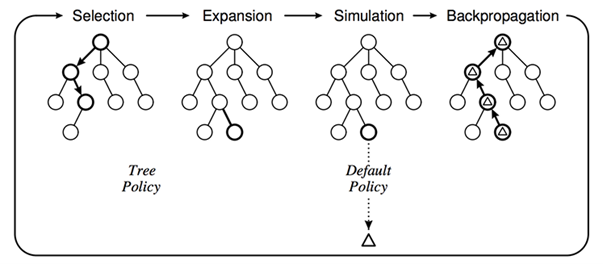

# TicTacToe

Monti Carlo Tree Search (MCTS) 以模擬隨機遊戲的方式，透過模擬大量隨機的遊戲走步，來探索決策樹的不同分支。它運用隨機模擬遊戲的結果，不斷擴展決策樹的節點，並根據模擬結果和已有的資訊來優化選擇最有可能導致勝利的走步。

## 演算法流程

1. Selection：若從根節點R開始，連續向下選擇子節點直到抵達leaf node L。至於每一次哪條路徑，是依據下面公式，其又稱作UCT（Upper Confidence Bounds to Trees），在選擇接下來的節點時，它能夠平衡exploitation (利用) 和 exploration (探索)，其除了往獲勝率較高的路徑走之外，它也會探索模擬次數較少的路徑。

$$\frac{w_i}{n_i}+c\sqrt{\frac{\ln{t}}{n_i}}$$

2.	Expansion：經過Selection之後，選擇到的節點為leaf node且並被更新的話，就執行Expansion，根據棋盤上所剩位置建立一個或多個子節點並選取其中一個節點C。

3.	Simulation：若選擇的節點並未更新過的話，就從該節點用隨機策略進行遊戲，直到遊戲結束產生結果。此步驟又稱為playout或者rollout。

4.	Backpropagation：使用隨機遊戲的結果，更新從C到R的路徑上的節點資訊。

    

## 運行結果

